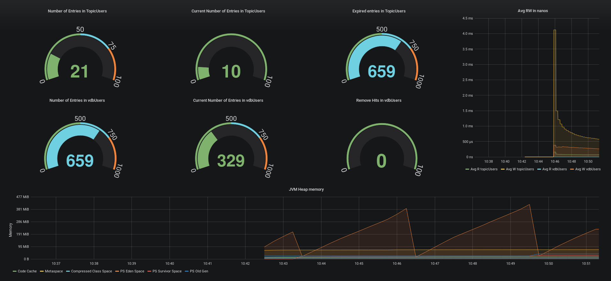

# Change Data Capture

In this post I'll show and describe how to achieve change-data-capture (aka CDC) using the most reliable open source softwares.
Here they are:
 * Docker
 * MS SQL
 * Debezium
 * Kafka
 * Teiid
 * And of course some Java code.


## Docker
Based on Linux Kernel capabilities, Docker got the idea to ship an application as a Linux container image (using the Docker format), to achieve consistency and reliability.

I would say the real "write once, run everywhere... as long as it's Linux".

More info on [docker.io](https://docker.io)

## Microsft SQL Server
A database platform...

I know, I said open source software, but I'm running the official Docker image, so at least is free!

They are getting there... 

## Debezium
No better explanation than the one taken from its site:
> Debezium is an open source distributed platform for change data capture.
> Debezium records in a transaction log all row-level changes committed to each database table. Each application simply reads the transaction logs their interested in, and they see all of the events in the same order in which they occurred.

More info on [debezium.io](https://debezium.io)

## Kafka
No better explanation than the one taken from its site:
> Kafka&reg; is used for building real-time data pipelines and streaming apps. It is horizontally scalable, fault-tolerant, wicked fast, and runs in production in thousands of companies.

## Teiid
No better explanation than the one taken from its site:
> Teiid offers a relational abstraction of all information sources that is highly performant and allows for integration with your existing relational tools. Teiid has an accompanying easy-to-use design tool that enables data architects to integrate disparate information in minutes.

## Java code
You can find everything it this repo:
 - https://github.com/foogaro/change-data-capture/tree/master/infinispan-teiid
 
# Architecture  

There:


So basically, this is the flow:
 * some external software adds new records into the database;
 * the database stores the data and updates its transaction log;
 * Debezium reads the transaction log and receives the changes from the databases (either insert, or update, or delete);
 * Debezium sends those changes as single event to a Kafka topic;
 * The [InfinispanSinkConnector](https://github.com/infinispan/infinispan-kafka) receives those events from the topic, and it sends them to Infinispan;
 * A cache listener on Infinispan elaborates the new key and converts the message in a POJO (with ProtoBuf annotations);
 * Asynchronously... Teiid exposes the Infinispan caches providing support for JDBC, ODBC and OData4 protocols for client applications;
 * Applications can query and aggregate the data they need connecting directly to Teiid and proudly show their dashboards.
 
 Now, all this work is implemented for you as MVPoC.
 It would be really cool if you could contribute by fixing the following issues:
 * Fix the [issue#1](https://github.com/foogaro/change-data-capture/issues/1) for the Infinispan custom cache-store and get rid of the ``` @ClientListener``` running as ``` while (true) {} ``` in a Java [class](https://github.com/foogaro/change-data-capture/blob/master/infinispan-teiid/infinispan-listener/src/test/java/com/foogaro/cdc/infinispan/InfinispanKafkaRunner.java).
 * Fix the [issue#2](https://github.com/foogaro/change-data-capture/issues/2) to run it all on OpenShift;
 * Fix the [issue#3](https://github.com/foogaro/change-data-capture/issues/3) to show cache metrics in Grafana.

# Running the all thing

As easy as 
```bash
./scripts/run-them-all
```


# Running the all thing

Here it is the Grafana dashbaord to monitor the Infinispan caches:




# Demo
You can find a _playback_ demo [here](https://github.com/foogaro/change-data-capture/tree/master/demo).

The _playback_ demo can be download both as GIF or WEBM file.


# Implementation Details
Now I'm really tired.

If you need, drop me an email.


Ciao,

Luigi
